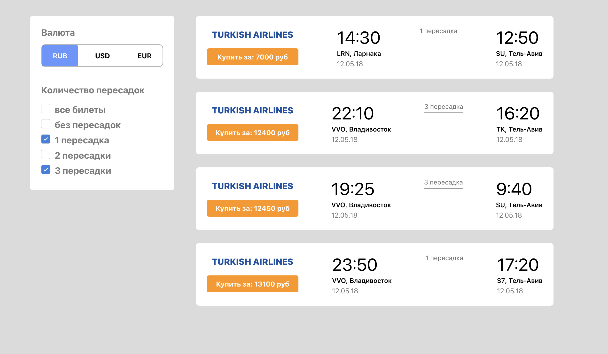
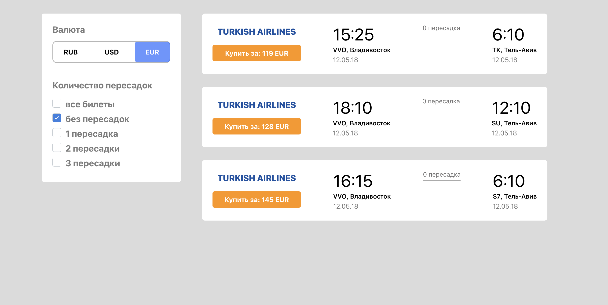

# TiketsApp
Тестовое задание поиска и фильтрации авиабилетов 

### Стек

1. React
2. Typescript
4. CSS-modules

### Функционал

1. Основная страница, на которой отображаются все билеты, которые подгружаются из БД(реализация на фронте)
2. По умолчанию сортировка производится по возврастанию цены. В меню настроек поиска можно задать фильтрацию по колличеству пересадок. Так же можно выбрать один из трех выборов оплат
3. Реализовано для мобтльной и десктопной версии 

### Начало работы

Установка зависимостей

```
npm install
```

Запуск приложения

```
npm start
```

### Перейти на сайт можно по ссылке:
https://igorgap.github.io/TiketsApp/


<p>
</p>

<p>
